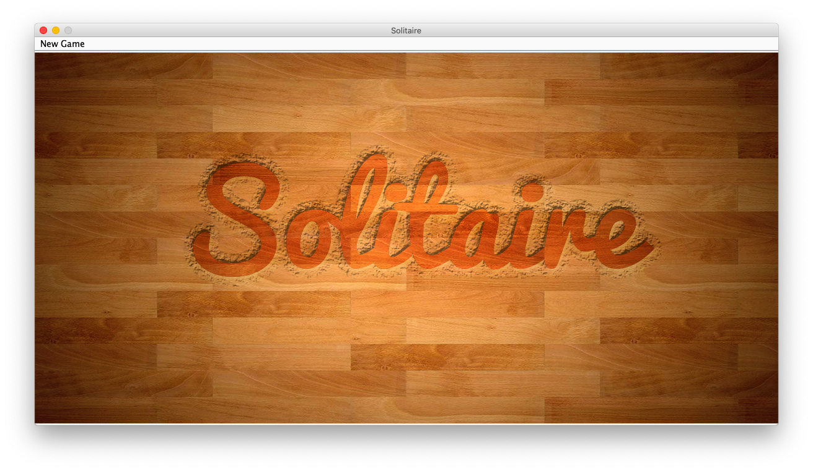
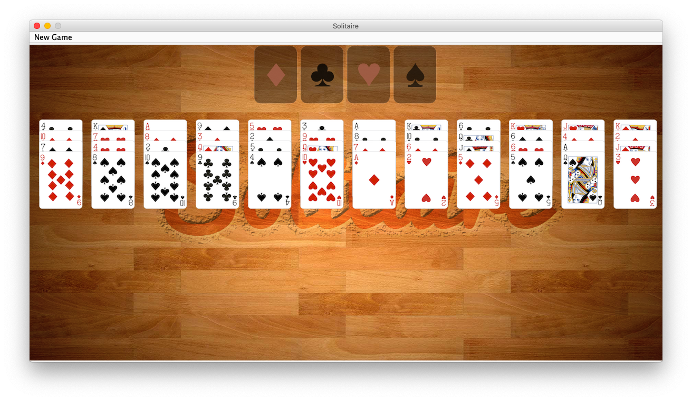
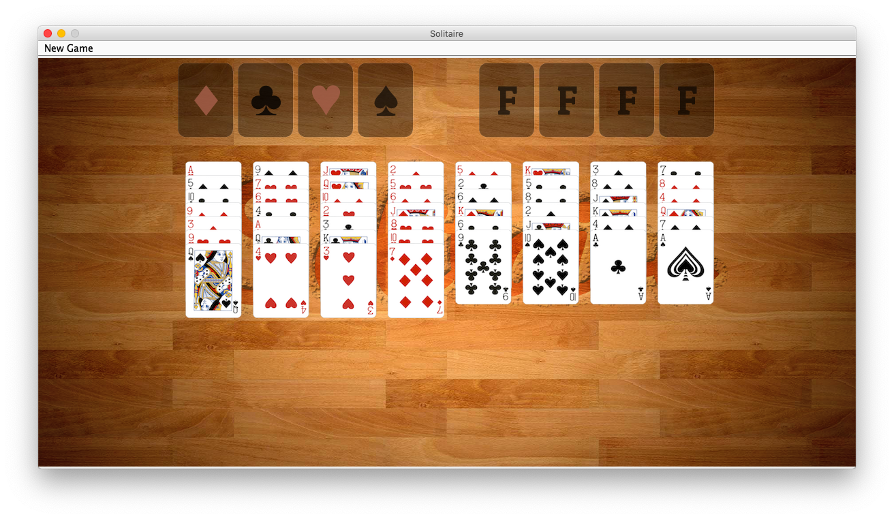
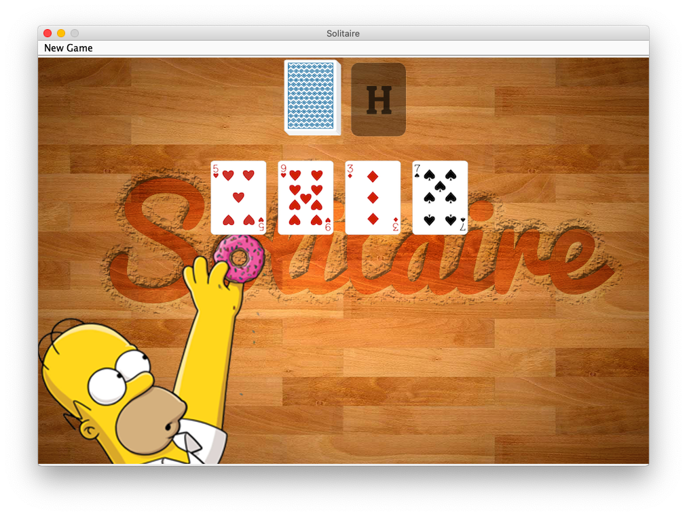

# Solitaire

### Description ###
This project consists of three different variants of the traditional Solitaire card game: 
  1. Aces Up
  2. Baker's Dozen
  3. FreeCell
  
The entire game is developed in Java within the Eclipse IDE. To run, open the project within Eclipse and click run. In the 'New Game' tab, choose the version of Solitaire that you wish to play. To exit, simply close the window and exit Eclipse. 

### Screenshots ###

#### Start Screen ####

#### Baker's Dozen ####

#### FreeCell ####

#### Ace's Up ####

